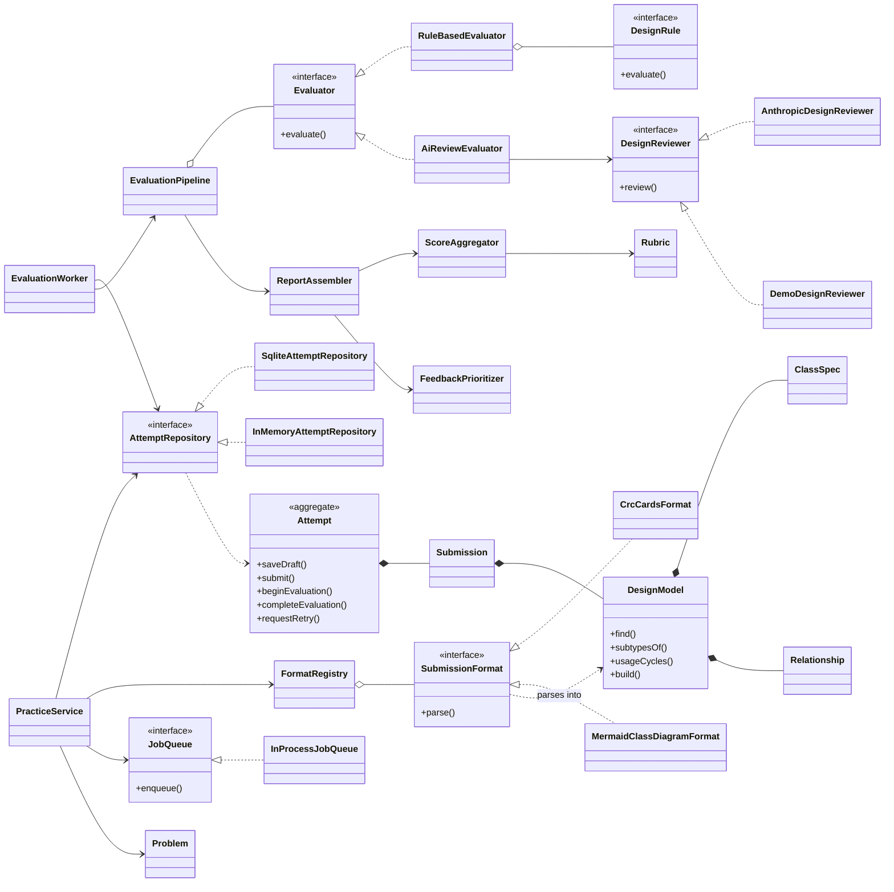
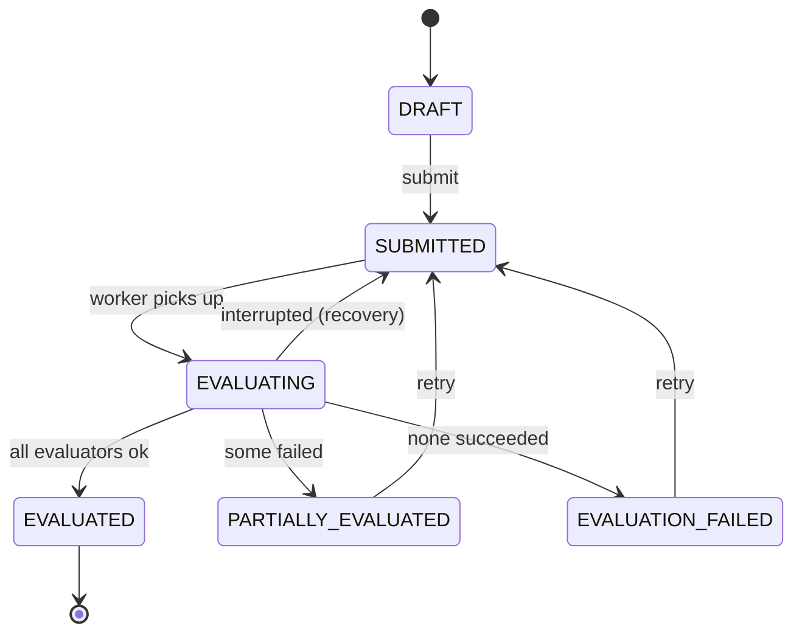
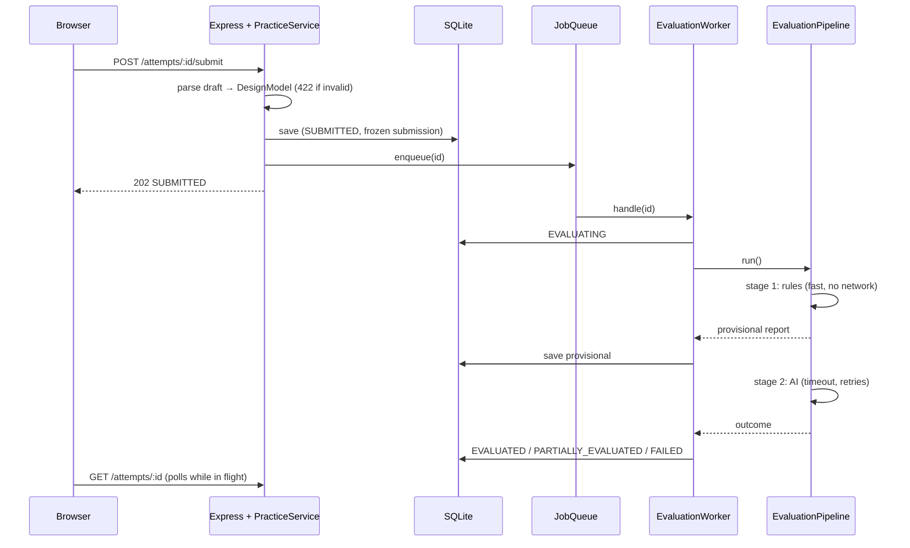

# Design note

## 1. The MVP in one paragraph

A learner picks one of four LLD problems, writes down their assumptions, designs it (class cards or Mermaid), answers "what changes if…?" questions against their own classes, and explains their trade-offs. They submit and see, within seconds, a score on five dimensions, three things to do next, and findings that each cite the class, requirement or scenario they are about. An AI review adds judgement when configured. They revise (pre-filled from the last submission) and the platform shows which structural problems they fixed, which remain, and which are new.

**Deliberately out of scope:** accounts, an LMS, a drawing canvas, code submissions, multi-tenant scale. The prototype is a monolith.

### User flow

```
Problems ──▶ Problem page ──▶ Workspace (draft, autosaved)
                                 1 Clarify   2 Design   3 Stress-test   4 Explain
                                                │
                                          Submit for feedback
                                                │
        ┌───────────────────────────────────────┘
        ▼
   Review page ── queued → provisional (structural) feedback → final (or partial + Retry)
        │
        ├─ Revise this attempt ──▶ new draft pre-filled from this submission
        └─ Problem page: trend, "what changed since attempt N", common approaches
```

## 2. The five design questions

### What does a learner need to provide for an attempt to be meaningful?

A diagram alone cannot be judged: you cannot tell whether a box is a considered decision. An attempt therefore has four parts, mirroring how the design is actually reasoned about in an interview:

1. **Assumptions**: the clarifications a vague prompt demands (scope, failure behaviour, limits).
2. **The design**, with a **one-sentence responsibility per class** (the CRC-card idea): the piece bare diagrams let you skip, and the piece cohesion is judged from.
3. **Answers to change scenarios** ("EV spots arrive: which classes change and which do you add?"): the cheapest honest test of extensibility, and it is tied to the learner's own class names.
4. **Decisions and trade-offs**: what was chosen, why, and what was rejected.

### What makes feedback useful when more than one design is valid?

- Judge **principles, not a reference design**: a five-dimension rubric (requirements coverage, responsibility assignment, abstractions & relationships, extensibility, assumptions & trade-offs).
- Match required concepts by **vocabulary**, not class names: `FeeCalculator`, `PricingStrategy` and `TariffPolicy` all cover "pricing" (there is a test for this).
- Every finding is **checkable and actionable**: title, why it matters, what to try, evidence (the class / requirement / scenario), source (rule or AI), and a confidence.
- **Acknowledge alternatives** instead of penalising them: the AI reports valid choices that differ from the common approach, with the trade-off to be ready to explain.
- **Heuristics can be wrong**, so they carry a confidence and the AI can *dispute* one ("this is a facade; being wide is fine here"). A disputed finding is demoted and never leads the advice.
- Feedback is prioritised: at most three "do these next", at most two per dimension.
- Scores are **coarse (0–4)** and every dimension expands into the named criteria behind it.

### Which parts should be deterministic, and which use an LLM?

| Deterministic (14 rules) | LLM |
|---|---|
| Does every required capability have an owner? | Is this class's responsibility actually cohesive? |
| Interface with no implementations; dependency on a concrete class that has an interface; cycles; deep inheritance; isolated classes | Are the relationship kinds and directions right for the domain? |
| God-class and vague-name *smells* (with a confidence) | Do the change-scenario answers hold up against the classes drawn? |
| Are variation points behind an abstraction (interface, or an enum where the problem allows)? | Are the stated trade-offs sound? |
| Were assumptions, decisions and scenario answers provided? | Which of the learner's choices are valid alternatives to the common ones? |

Rules are instant, offline, reproducible and cheap, so they run first and their feedback is shown immediately. The LLM is used only for what rules cannot see, and it is **bounded** (section 5).

### How would another evaluation approach or submission format be added?

Both are seams with a single narrow interface.

- **New submission format** (PlantUML, a code skeleton parsed with tree-sitter…): implement `SubmissionFormat { parse(payload) → DesignModel }` and register it in `formats/index.ts`. Nothing else changes, because evaluators only ever read the canonical `DesignModel`. The client falls back to a JSON editor for a format it has no UI for, so a new format works end to end on day one. To prove the seam, the platform ships two formats, and the client converts a design between them.
- **New evaluator** (run learner-supplied tests, a peer-review step, a different model): implement `Evaluator { evaluate(ctx, signal) → assessments + findings }` and add it to the pipeline's slot list with a timeout/retry policy. Scoring, prioritisation, degradation, and the UI need no changes, and the report lists which evaluator produced what.
- **New rule**: implement `DesignRule` (one method) and add it to `defaultRules()`.
- **Different model vendor**: implement `DesignReviewer`. Validation and safety live in `AiReviewEvaluator`, so they apply to every adapter.
- **New problem**: a data file: requirements, capabilities (as vocabulary), variation points, change scenarios, common approaches.

### What if evaluation takes time or fails?

Evaluation is **asynchronous and staged**; submission returns immediately.

```
SUBMITTED ─▶ EVALUATING (deterministic stage → provisional report saved)
                        └▶ AI stage (own timeout, retries with backoff)
                              ├─ ok            → EVALUATED
                              ├─ failed/timeout → PARTIALLY_EVALUATED  (real feedback + Retry)
                              └─ nothing ran    → EVALUATION_FAILED    (+ Retry)
```

- The learner sees **structural feedback within about a second**, while the AI is still running (a banner says so). This was checked in a real browser with a deliberately slow reviewer.
- Each evaluator has a **time budget** enforced by racing it against a timer *and* aborting its signal, so a hung or signal-ignoring evaluator cannot stall the pipeline.
- **Only transient failures retry** (rate limit, 5xx, network, malformed reply, timeout), with exponential backoff. Permanent failures (bad key, refusal, bug) do not.
- **One evaluator failing never discards another's result.** Scores use only what ran; the UI says what is missing and why, in words that never echo upstream internals.
- **Bounded spend**: at most five evaluation runs per attempt.
- **Crash-safe**: the attempt's status in the database is the source of truth. On start-up, `EVALUATING` attempts are re-queued (unless they have exhausted their runs, which stops a poison submission from crash-looping the process).
- The worker is **idempotent** (duplicate deliveries are skipped) and **never leaves an attempt stuck in `EVALUATING`**.

## 3. Domain model



### Responsibilities, in one line each

| Class | Responsibility |
|---|---|
| `Attempt` | Aggregate root: owns the lifecycle, the draft (with revisions), the frozen submission, and the report. Refuses illegal transitions itself. |
| `DesignModel` | Format-independent design. Enforces invariants (unique names, valid endpoints, no inheritance cycles, size limits) and answers structural questions (implementors, cycles, depth). |
| `SubmissionFormat` | Turn one input syntax into a `DesignModel`, reporting problems in the learner's terms (line numbers, field names). |
| `Problem` | The brief the learner sees, plus the hidden knowledge used to judge open-ended answers (capabilities as vocabulary, variation points, scenarios). Validates itself at start-up. |
| `Rubric` | What "good" means, with level descriptors. Shared by the rules (as checks) and by the AI (verbatim in its prompt). |
| `DesignRule` | One independent, explainable check that returns findings *and* the rubric criteria it examined (including those that passed). |
| `Evaluator` | One way of judging a submission. The pipeline knows only this interface. |
| `EvaluationPipeline` | Runs evaluators in stages with per-evaluator timeout and retry; always returns something honest. |
| `ScoreAggregator` | Combines opinions into one score per dimension, with guardrails (below). |
| `FeedbackPrioritizer` | Ranks findings; picks the short "do these next" list. |
| `ReportAssembler` | Merges everything into the report; applies AI disputes to rule findings. |
| `EvaluationWorker` | Drives one attempt through evaluation; idempotent; recovers on start-up. |
| `PracticeService` | The learner-facing use cases. The only place learner ownership is enforced. |
| `AttemptRepository` / `JobQueue` / `DesignReviewer` | Ports. SQLite, in-process queue and Claude are adapters. |

### Patterns, and where they earn their place

- **Strategy**: `DesignReviewer`, `SubmissionFormat`, `Evaluator`, `AggregationPolicy`.
- **Ports & adapters (hexagonal)**: domain and application depend on interfaces; `compositionRoot.ts` is the only place concrete classes are chosen.
- **Aggregate + repository**: `Attempt` is always loaded and saved whole.
- **State as a transition table, not state classes**: statuses differ only in which transitions are legal, not in behaviour, so a table (`AttemptStatus.ts`) is smaller and reads at a glance. State classes would be ceremony here.
- **Specification-style rules**: many small `DesignRule`s composed by `RuleBasedEvaluator`, instead of one large checker.
- **Facade**: `PracticeService` for the HTTP layer; `EvaluationPipeline` for evaluation.
- **Optimistic concurrency**: draft revisions reject stale autosaves.



`requestRetry` is explicitly limited to the two failure states. `EVALUATING → SUBMITTED` is legal for crash recovery, and a test that tried to retry an in-flight attempt caught that a learner could otherwise re-queue an evaluation a worker was still running.

## 4. Evaluation pipeline



### The rules (all in `server/src/evaluation/rules`)

| Dimension | Rules |
|---|---|
| Requirements | capability coverage (covered / mentioned-only / missing, by vocabulary) |
| Responsibilities | responsibilities stated, god-class smell, vague names, design size |
| Abstractions | dead abstractions, no abstractions, isolated classes, inheritance depth, dependency on concretions, dependency cycles |
| Extensibility | variation points behind abstractions, change-scenario answers |
| Communication | assumptions stated, trade-offs articulated |

The overall score weights the dimensions **Responsibilities 25%, Extensibility 25%, Requirements 20%, Abstractions 20%, Trade-offs 10%**. Extensibility counts as much as ownership of responsibilities because how a design copes with change is the real test of LLD.

Each rule reports the **criteria** it examined, each scored 0–4 with a weight and a reason, including the ones that passed. A dimension's structural score is the weighted mean of its criteria, so a score can always be explained as a list of named things.

### Blending, and the guardrails

`ScoreAggregator` combines the structural score (weight 0.4) and the AI score (0.6) per dimension, then applies:

1. **The AI cannot be much more generous than the evidence.** Its score is clamped to `[structural − 2, structural + 1]`, and the report says when it was.
2. **Deterministic caps bind whatever the AI thinks** (for example, fewer than three classes caps everything at 1.5; under half the capabilities owned caps requirements at 1.5).
3. **Structural checks alone cannot award the top band** (cap 3.4). Rules can confirm a design is well formed but not that responsibilities are cohesive, so "Strong" needs an AI review. This was added after seeing rules alone give a perfect 4.0 in the real UI.

### Making the AI safe to show a learner (`ReviewSanitizer`, `ReviewPromptBuilder`)

- **Output is schema-constrained** at generation time, then validated again. A malformed or empty reply is a *transient* failure (retried).
- **Evidence is verified**: every class a finding cites must exist in the learner's design. Non-existent citations are dropped and the finding is demoted to low confidence; a structural accusation left with no real evidence becomes a minor note.
- **Bounded output**: scores clamped, text truncated, at most six findings, duplicates and unknown dimensions discarded, and the model cannot emit a `critical` finding (the schema cannot express it).
- **Disputes** may only target real, non-critical rule findings.
- **Prompt injection**: learner text is wrapped in tagged blocks, angle brackets are neutralised so it cannot forge the prompt's structure, and the system prompt tells the model the text is untrusted. (Tested structurally. Robustness against a determined adversary is not claimed.)

## 5. Key trade-offs

| Decision | Alternative | Why |
|---|---|---|
| Structured cards + Mermaid text | A drawing canvas / image upload | A canvas needs vision to read and gives nothing to validate. Text formats parse exactly and convert to each other. |
| Vocabulary matching for requirement coverage | Match a reference class list | Reference lists punish valid alternatives. Cost: unusual naming can give a false "missing", mitigated by confidence, partial credit, and AI disputes. |
| Hybrid: rules + bounded LLM | LLM alone, or rules alone | Rules alone cannot judge cohesion or sound trade-offs. An LLM alone is slow, non-reproducible, and can hallucinate or flatter. |
| Coarse 0–4 bands, explainable | A 0–100 score | False precision invites gaming ([research note](RESEARCH.md)). Bands with reasons push attention to the findings. |
| Reveal common approaches after the first submission | Show solutions up front | Comparing is only useful after trying. |
| In-process queue + SQLite JSON documents | A broker and normalised tables | The status column is already the durable queue; the aggregate is always loaded whole. Both are behind ports. |
| Anonymous learner id | Auth | Out of scope for the prototype; scoping is enforced in one place so real auth slots in. |
| A partial result is a first-class state | Failing the whole attempt | A learner with 80% of the feedback should not get an error page. |

## 6. A light word on scale (not built)

The prototype is one process, and that is fine to a point. To handle more learners and slower AI:

- The API is stateless apart from the in-process queue. Move the queue behind the `JobQueue` port to a broker (SQS/BullMQ) and run workers separately; the database status is already the recovery mechanism.
- Swap SQLite for Postgres behind `AttemptRepository` (the contract test suite already defines correct behaviour for an adapter).
- AI calls are the cost and latency hot spot: they are bounded per attempt, the system prompt is static (a good prompt-caching candidate), and concurrency is capped by `LLD_WORKER_CONCURRENCY`. A per-learner rate limit would be the next guard.
- Structural feedback is CPU-trivial and does not depend on the AI, which is what keeps the product useful when the AI is the bottleneck.
